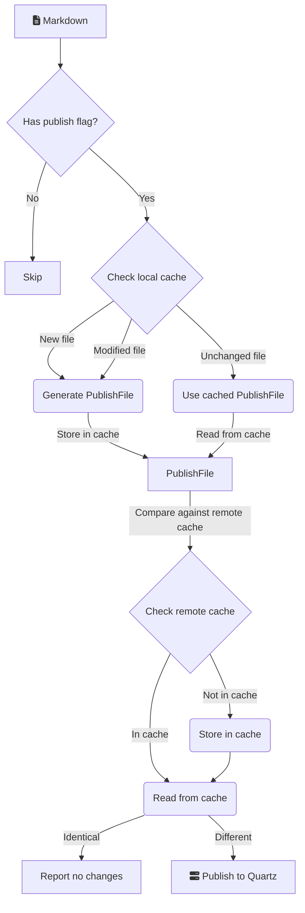

---
{"publish":true,"title":"Enable caching","description":"Whether to cache note compilation results to greatly improve performance.","created":"2025-07-02T22:25:52.181+02:00","modified":"2025-07-02T22:25:52.181+02:00","tags":["settings/performance"],"cssclasses":""}
---

