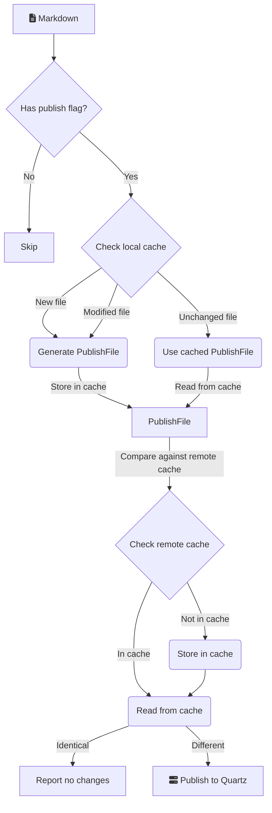

---
{"publish":true,"title":"Enable caching","description":"Whether to cache note compilation results to greatly improve performance.","created":"2025-06-12T22:44:54Z+0200","modified":"2025-06-19T08:17:08Z+0200","tags":["settings/performance"],"cssclasses":""}
---

